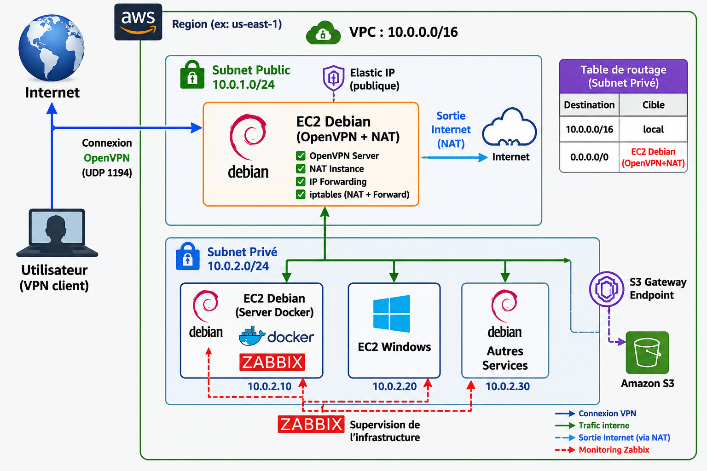

<div align="center">

# 🏗️ Mise en œuvre d'une infrastructure cloud sécurisée sous AWS basée sur OpenVPN, une NAT Instance Debian et la supervision centralisée avec Zabbix

### Laboratoire Cloud AWS — OpenVPN + NAT Instance Debian + Supervision Centralisée Zabbix

*Un lab complet, sécurisé et supervisé sur AWS — déployable à coût quasi nul grâce au Free Tier*

---

[](https://aws.amazon.com/free/)
[](https://www.debian.org/)
[](https://openvpn.net/)
[](https://docs.docker.com/compose/)
[](https://www.zabbix.com/)
[](LICENSE)

---

**Auteur** : [@Arthur-Netdevops](https://github.com/Arthur-Netdevops)  • **Coût** : ~0 $/mois

</div>

---

## 📑 Table des matières

- [🎯 Présentation du projet](#-présentation-du-projet)
- [💡 Pourquoi ce choix technique ?](#-pourquoi-ce-choix-technique-)
- [🏛️ Architecture](#️-architecture)
- [✅ Prérequis](#-prérequis)
- [🗂️ Structure du repo](#️-structure-du-repo)
- [🚀 Partie 1 — OpenVPN + NAT Instance](#-partie-1--openvpn--nat-instance)
- [🐳 Partie 2 — Zabbix via Docker](#-partie-2--zabbix-via-docker)
- [📡 Partie 3 — Agents Zabbix](#-partie-3--agents-zabbix)
- [✔️ Vérifications finales](#️-vérifications-finales)
- [💰 Récapitulatif des coûts](#-récapitulatif-des-coûts)
- [🔧 Dépannage](#-dépannage)
- [📜 Licence](#-licence)

---

## 🎯 Présentation du projet

Ce dépôt documente le déploiement d'un **laboratoire cloud complet sur AWS**, conçu pour être reproductible par n'importe qui — même sans expérience préalable d'AWS.

### Ce que tu vas construire

| Composant | Rôle | Technologie |
|---|---|---|
| Serveur VPN | Accès sécurisé au réseau privé depuis n'importe où | OpenVPN (UDP 1194) |
| NAT Instance | Sortie internet pour les instances privées | iptables + IP Forwarding |
| Supervision | Monitoring de toute l'infrastructure | Zabbix via Docker |
| PKI locale | Authentification par certificats | EasyRSA |

### Ce que tu vas apprendre

- 🔐 Configurer un accès VPN sécurisé par certificats sur AWS
- 🌐 Mettre en place une NAT Instance pour remplacer le NAT Gateway AWS
- 🐳 Déployer une stack de supervision complète avec Docker Compose
- 📊 Superviser des machines Windows et Linux avec Zabbix
- 💸 Optimiser les coûts AWS pour un environnement de lab

---

## 💡 Pourquoi ce choix technique ?

AWS propose des services managés pour le VPN et le NAT, mais leur coût est **prohibitif pour un lab**. Voici pourquoi nous avons choisi une approche différente.

### ❌ Les services managés AWS — trop chers pour un lab

#### AWS Client VPN Endpoint

> Le service VPN natif d'AWS utilise un modèle de facturation à l'heure, même sans connexion active.

| Poste de facturation | Coût |
|---|---|
| Association de subnet | ~0,10 $/heure |
| Connexion VPN active | ~0,05 $/heure |
| **Total mensuel estimé** | **~72 $ à 150 $/mois** |

#### AWS NAT Gateway

> Facturé à l'heure ET au volume de données, même sans trafic.

| Poste de facturation | Coût |
|---|---|
| Heure de fonctionnement | ~0,045 $/heure |
| Données traitées | ~0,045 $/Go |
| **Total mensuel estimé** | **~32 $/mois minimum** |

---

### ✅ Notre approche — OpenVPN + NAT Instance sur EC2

> Une seule instance EC2 t2.micro fait le travail des deux services managés, pour un coût quasi nul.

| Composant | Coût |
|---|---|
| EC2 t2.micro (750h/mois Free Tier) | **0 $/mois** |
| OpenVPN (open source) | **0 $/mois** |
| iptables NAT (intégré Linux) | **0 $/mois** |
| **Total mensuel** | **~0 $/mois** |

### 📊 Comparaison directe

```
╔══════════════════════════════════════════════════════╗
║  AWS Client VPN + NAT Gateway  →  ~180-220 $/mois   ║
║  OpenVPN + NAT Instance        →    ~0 $/mois        ║
║                                                      ║
║  Économie : ~2 160 $/an  💰                          ║
╚══════════════════════════════════════════════════════╝
```

> ⚠️ **Note** : Pour une infrastructure de production en entreprise, les services managés AWS restent le bon choix (haute disponibilité, scalabilité, support AWS). Notre approche est optimisée pour **apprendre et expérimenter**.

---

## 🏛️ Architecture


### Flux réseau

| Flux | Chemin | Protocole |
|---|---|---|
| Connexion VPN client | Internet → EC2 Debian Public | UDP 1194 |
| Sortie internet subnet privé | EC2 privé → EC2 public (NAT) → Internet | TCP/UDP |
| Supervision | Agents → Zabbix Server (Docker) | TCP 10050 |
| Accès Web Zabbix | Client VPN → EC2 Docker port 80 | TCP 80 |

### Plan d'adressage

| Réseau | CIDR | Rôle |
|---|---|---|
| VPC | 10.0.0.0/16 | Réseau global AWS |
| Subnet Public | 10.0.2.0/24 | EC2 OpenVPN + NAT |
| Subnet Privé | 10.0.1.0/24 | EC2 Docker, Windows, Autres |
| Réseau VPN clients | 172.16.10.0/24 | IPs attribuées aux clients VPN |

---

## ✅ Prérequis

### Compte AWS
- Un compte AWS actif (nouveau compte = 12 mois de Free Tier)
- Les ressources suivantes **déjà créées** avant de commencer :
  - VPC `10.0.0.0/16` avec Internet Gateway
  - Subnet public `10.0.2.0/24`
  - Subnet privé `10.0.1.0/24`
  - EC2 Windows et EC2 Debian "Autres Services" déjà démarrés

### Instances EC2 nécessaires

| Instance | Subnet | OS | IP |
|---|---|---|---|
| EC2 Debian (OpenVPN + NAT) | Public 10.0.2.0/24 | Debian 13 (Trixie) | 10.0.2.148 + Elastic IP |
| EC2 Debian Docker (Zabbix) | Privé 10.0.1.0/24 | Debian 12+ | 10.0.1.x |
| EC2 Windows Server | Privé 10.0.1.0/24 | Windows Server | 10.0.1.x |
| EC2 Debian Autres Services | Privé 10.0.1.0/24 | Debian 12+ | 10.0.1.x |

### Outils locaux

- Client SSH → Terminal (Linux/Mac) ou PuTTY (Windows)
- Client OpenVPN → [OpenVPN Connect](https://openvpn.net/client/) (Windows/Mac/Android/iOS)
- Clé `.pem` AWS pour la connexion SSH
- Navigateur web (pour l'interface Zabbix)

---

## 🗂️ Structure du repo

```
aws-openvpn-nat-zabbix-infrastructure/
│
├── README.md                  ← Ce guide complet
├── architecture.png           ← Schéma d'architecture
│
├── configs/
│   ├── server.conf            ← Configuration OpenVPN serveur
│   ├── client.ovpn.template   ← Template fichier client VPN
│   └── docker-compose.yml     ← Stack Zabbix complète
│
└── scripts/
    ├── setup-openvpn-nat.sh   ← Script d'installation OpenVPN + NAT
    └── setup-zabbix-agent.sh  ← Script d'installation agent Zabbix (Linux)
```

---

## 🚀 Partie 1 — OpenVPN + NAT Instance

> **Où ?** Sur l'EC2 Debian du subnet public (10.0.2.148)

Connecte-toi en SSH :

```bash
ssh -i ta-cle.pem admin@<ELASTIC_IP>
```

### Étape 1 — Mise à jour du système

```bash
sudo apt update && sudo apt upgrade -y
```

### Étape 2 — Installation d'OpenVPN et EasyRSA

```bash
sudo apt install openvpn easy-rsa -y
```

### Étape 3 — Initialisation de la PKI

> La PKI (Public Key Infrastructure) est l'ensemble des certificats qui permettent l'authentification sécurisée entre le client et le serveur VPN.

```bash
make-cadir ~/easy-rsa
cd ~/easy-rsa
./easyrsa init-pki
```

### Étape 4 — Création de l'Autorité de Certification (CA)

```bash
./easyrsa build-ca nopass
```

> 💬 Quand il demande un **Common Name**, tape `OpenVPN-CA` et appuie sur Entrée.

### Étape 5 — Certificat serveur

```bash
# Génération
./easyrsa gen-req server nopass
# Common Name → "server"

# Signature
./easyrsa sign-req server server
# Confirme avec "yes"
```

### Étape 6 — Paramètres Diffie-Hellman

```bash
./easyrsa gen-dh
```

> ⏳ Cette commande peut prendre **2 à 5 minutes**. C'est normal.

### Étape 7 — Certificat client

```bash
./easyrsa gen-req client1 nopass
# Common Name → "client1"

./easyrsa sign-req client client1
# Confirme avec "yes"
```

### Étape 8 — Copie des certificats

```bash
sudo cp ~/easy-rsa/pki/ca.crt /etc/openvpn/
sudo cp ~/easy-rsa/pki/issued/server.crt /etc/openvpn/
sudo cp ~/easy-rsa/pki/private/server.key /etc/openvpn/
sudo cp ~/easy-rsa/pki/dh.pem /etc/openvpn/
```

### Étape 9 — Configuration OpenVPN

```bash
sudo nano /etc/openvpn/server.conf
```

```conf
port 1194
proto udp
dev tun

ca /etc/openvpn/ca.crt
cert /etc/openvpn/server.crt
key /etc/openvpn/server.key
dh /etc/openvpn/dh.pem

# Réseau attribué aux clients VPN
server 172.16.10.0 255.255.255.0

# Route vers le subnet privé poussée aux clients
push "route 10.0.1.0 255.255.255.0"

keepalive 10 120
cipher AES-256-CBC
persist-key
persist-tun

status /var/log/openvpn-status.log
log-append /var/log/openvpn.log
verb 3
```

### Étape 10 — Activation de l'IP Forwarding

> L'IP Forwarding permet à l'instance de faire transiter du trafic entre interfaces (indispensable pour le NAT).

```bash
sudo nano /etc/sysctl.conf
# Décommenter la ligne :
# net.ipv4.ip_forward=1

# Appliquer immédiatement
sudo sysctl -p
```

### Étape 11 — Configuration NAT avec iptables

```bash
# Vérifier le nom de l'interface réseau (généralement ens5 sur AWS)
ip a

# Règles NAT pour les clients VPN
sudo iptables -t nat -A POSTROUTING -s 172.16.10.0/24 -o ens5 -j MASQUERADE

# Règles NAT pour le subnet privé
sudo iptables -t nat -A POSTROUTING -s 10.0.1.0/24 -o ens5 -j MASQUERADE

# Autoriser le forwarding
sudo iptables -A FORWARD -i tun0 -o ens5 -j ACCEPT
sudo iptables -A FORWARD -i ens5 -o tun0 -m state --state RELATED,ESTABLISHED -j ACCEPT
sudo iptables -A FORWARD -i ens5 -o ens5 -s 10.0.1.0/24 -j ACCEPT

# Rendre les règles persistantes
sudo apt install iptables-persistent -y
sudo netfilter-persistent save
```

### Étape 12 — Démarrage d'OpenVPN

```bash
sudo systemctl enable openvpn@server
sudo systemctl start openvpn@server

# Vérification
sudo systemctl status openvpn@server   # → active (running)
ip a show tun0                          # → doit afficher 172.16.10.1
```

### Étape 13 — Création du fichier client .ovpn

```bash
nano ~/client1.ovpn
```

```conf
client
dev tun
proto udp
remote <ELASTIC_IP> 1194

resolv-retry infinite
nobind
persist-key
persist-tun
cipher AES-256-CBC
verb 3

<ca>
# Contenu de : cat ~/easy-rsa/pki/ca.crt
</ca>

<cert>
# Contenu de : cat ~/easy-rsa/pki/issued/client1.crt
# (partie -----BEGIN CERTIFICATE----- à -----END CERTIFICATE-----)
</cert>

<key>
# Contenu de : cat ~/easy-rsa/pki/private/client1.key
</key>
```

Récupère le fichier sur ta machine locale :

```bash
scp -i ta-cle.pem admin@<ELASTIC_IP>:~/client1.ovpn .
```

### Étape 14 — Configuration AWS (console)

#### 14a. Désactiver la vérification source/destination

> ⚠️ **Critique** : Sans cette étape, AWS bloque le trafic NAT.

```
EC2 → Instances → Sélectionner l'EC2 public
→ Actions → Networking → Change source/destination check
→ Désactiver → Save
```

#### 14b. Route table du subnet privé

```
VPC → Route Tables → Sélectionner la RT du subnet privé (10.0.1.0/24)
→ Routes → Edit routes → Add route

Destination : 0.0.0.0/0
Cible : Instance → EC2 Debian public
```

#### 14c. Security Group de l'EC2 public — Inbound rules

| Type | Protocole | Port | Source |
|---|---|---|---|
| Custom UDP | UDP | 1194 | 0.0.0.0/0 |
| SSH | TCP | 22 | Ton IP |
| All traffic | All | All | 10.0.1.0/24 |

### ✅ Test de validation

```bash
# Depuis une instance du subnet privé
ping 8.8.8.8 -c 4   # → doit fonctionner via NAT
```

Connecte ton client VPN avec le fichier `.ovpn` → tu dois obtenir une IP en `172.16.10.x`

---

## 🐳 Partie 2 — Zabbix via Docker

> **Où ?** Sur l'EC2 Debian Docker du subnet privé

Connecte-toi via SSH (ou via le tunnel VPN) :

```bash
ssh -i ta-cle.pem admin@<IP_EC2_DOCKER>
```

### Étape 1 — Création du répertoire

```bash
mkdir ~/zabbix && cd ~/zabbix
```

### Étape 2 — Fichier docker-compose.yml

```bash
nano docker-compose.yml
```

```yaml
services:
  postgres:
    image: postgres:15
    container_name: zabbix-db
    environment:
      POSTGRES_DB: zabbix
      POSTGRES_USER: zabbix
      POSTGRES_PASSWORD: zabbix_pass
    volumes:
      - postgres_data:/var/lib/postgresql/data
    restart: unless-stopped

  zabbix-server:
    image: zabbix/zabbix-server-pgsql:latest
    container_name: zabbix-server
    environment:
      DB_SERVER_HOST: postgres
      POSTGRES_DB: zabbix
      POSTGRES_USER: zabbix
      POSTGRES_PASSWORD: zabbix_pass
    ports:
      - "10051:10051"
    depends_on:
      - postgres
    restart: unless-stopped

  zabbix-web:
    image: zabbix/zabbix-web-nginx-pgsql:latest
    container_name: zabbix-web
    environment:
      DB_SERVER_HOST: postgres
      POSTGRES_DB: zabbix
      POSTGRES_USER: zabbix
      POSTGRES_PASSWORD: zabbix_pass
      ZBX_SERVER_HOST: zabbix-server
      PHP_TZ: Europe/Paris
    ports:
      - "80:8080"
    depends_on:
      - zabbix-server
    restart: unless-stopped

  zabbix-agent:
    image: zabbix/zabbix-agent:latest
    container_name: zabbix-agent
    environment:
      ZBX_SERVER_HOST: zabbix-server
      ZBX_HOSTNAME: zabbix-docker-server
    depends_on:
      - zabbix-server
    restart: unless-stopped

volumes:
  postgres_data:
```

### Étape 3 — Lancement

```bash
docker compose up -d
```

### Étape 4 — Vérification

```bash
docker compose ps
```

Résultat attendu :

```
NAME            IMAGE                                  STATUS
zabbix-agent    zabbix/zabbix-agent:latest             Up
zabbix-db       postgres:15                            Up
zabbix-server   zabbix/zabbix-server-pgsql:latest      Up
zabbix-web      zabbix/zabbix-web-nginx-pgsql:latest   Up (healthy)
```

### Étape 5 — Accès à l'interface Web

> 🔒 Tu dois être **connecté au VPN** pour accéder à l'interface.

```
URL    : http://<IP_EC2_DOCKER>
Login  : Admin
Passw  : zabbix
```

> 🔐 **Bonne pratique** : Change le mot de passe dès la première connexion → `User settings → Change password`

---

## 📡 Partie 3 — Agents Zabbix

### 3a. Agent sur EC2 Windows

#### Installation

1. Télécharger sur https://www.zabbix.com/download_agents
   - OS : Windows | CPU : amd64 | **Sans OpenSSL**

2. Lancer le `.msi` avec ces paramètres :
   - **Zabbix server IP** : `<IP_EC2_DOCKER>`
   - **Hostname** : `windows-server`
   - **Port** : `10050`

#### Vérification du service

```powershell
Get-Service "Zabbix Agent"   # → Status : Running
```

#### Ouverture du pare-feu Windows

```powershell
netsh advfirewall firewall add rule name="Zabbix Agent" dir=in action=allow protocol=TCP localport=10050
```

#### Ajout dans Zabbix

```
Configuration → Hosts → Create host
  Host name   : windows-server
  Groups      : Windows servers
  Interfaces  → Add → Agent
    IP         : <IP_EC2_WINDOWS>
    Port       : 10050
  Templates   → Windows by Zabbix agent
→ Add
```

---

### 3b. Agent sur EC2 Debian (Autres Services)

#### Installation

```bash
sudo apt update && sudo apt install zabbix-agent -y
```

#### Configuration

```bash
sudo nano /etc/zabbix/zabbix_agentd.conf
```

Modifier ces 3 lignes :

```conf
Server=<IP_EC2_DOCKER>
ServerActive=<IP_EC2_DOCKER>
Hostname=debian-autres-services
```

#### Démarrage

```bash
sudo systemctl enable zabbix-agent
sudo systemctl start zabbix-agent
sudo systemctl status zabbix-agent   # → active (running)
```

#### Ajout dans Zabbix

```
Configuration → Hosts → Create host
  Host name   : debian-autres-services
  Groups      : Linux servers
  Interfaces  → Add → Agent
    IP         : <IP_EC2_DEBIAN_SERVICES>
    Port       : 10050
  Templates   → Linux by Zabbix agent
→ Add
```

---

## ✔️ Vérifications finales

### OpenVPN + NAT

```bash
# Sur l'EC2 Debian public
sudo systemctl status openvpn@server     # active (running)
ip a show tun0                            # IP 172.16.10.1
sudo iptables -t nat -L -n -v            # Règles MASQUERADE présentes
```

### Zabbix — Monitoring → Hosts

| Hôte | Statut attendu |
|---|---|
| zabbix-docker-server | 🟢 ZBX vert |
| windows-server | 🟢 ZBX vert |
| debian-autres-services | 🟢 ZBX vert |

---

## 💰 Récapitulatif des coûts

| Ressource | Type | Coût |
|---|---|---|
| EC2 Debian public (OpenVPN+NAT) | t2.micro Free Tier | 0 $/mois |
| EC2 Debian Docker (Zabbix) | t2.micro Free Tier | 0 $/mois |
| EC2 Debian Autres Services | t2.micro Free Tier | 0 $/mois |
| EC2 Windows Server | t2.micro (non Free Tier) | ~15 $/mois |
| Elastic IP (associée à une instance) | VPC | 0 $/mois |
| Trafic réseau interne VPC | VPC | 0 $/mois |
| **Total estimé** | | **~15 $/mois** |

> 💡 **Astuce** : Arrête tes instances EC2 quand tu ne travailles pas sur le lab. Une instance arrêtée ne génère aucun coût de calcul.

---

## 🔧 Dépannage

<details>
<summary><b>🔴 Le tunnel VPN ne s'établit pas (timeout)</b></summary>

```bash
# Vérifier qu'OpenVPN écoute sur UDP 1194
sudo ss -ulnp | grep 1194

# Vérifier les logs
sudo tail -f /var/log/openvpn.log
```

**Causes fréquentes :**
- Port UDP 1194 non ouvert dans le Security Group de l'EC2 public → ajouter la règle inbound
- OpenVPN non démarré → `sudo systemctl start openvpn@server`

</details>

<details>
<summary><b>🔴 Le ping 8.8.8.8 ne fonctionne pas depuis le subnet privé</b></summary>

```bash
# Vérifier les règles iptables
sudo iptables -t nat -L -n -v
sudo iptables -L FORWARD -n -v

# Vérifier l'IP Forwarding
cat /proc/sys/net/ipv4/ip_forward   # doit afficher 1
```

**Checklist :**
- [ ] Source/destination check désactivé sur l'EC2 public
- [ ] Route `0.0.0.0/0 → EC2 public` présente dans la RT du subnet privé
- [ ] Security Group de l'EC2 public autorise `All traffic` depuis `10.0.1.0/24`
- [ ] Règle MASQUERADE pour `10.0.1.0/24` présente dans iptables

</details>

<details>
<summary><b>🔴 L'icône ZBX est rouge dans Zabbix</b></summary>

```bash
# Vérifier l'agent sur l'instance concernée
sudo systemctl status zabbix-agent

# Vérifier que le port écoute
sudo ss -tlnp | grep 10050
```

**Causes fréquentes :**
- Port TCP 10050 bloqué par le Security Group → ajouter la règle inbound
- Mauvaise IP du serveur Zabbix dans `zabbix_agentd.conf`
- Service zabbix-agent non démarré

</details>

<details>
<summary><b>🔴 Les conteneurs Docker ne démarrent pas</b></summary>

```bash
# Voir les logs d'erreur
docker compose logs

# Redémarrer proprement
docker compose down && docker compose up -d
```

</details>

---

## 📌 Points importants à retenir

> Ces points ont causé des erreurs pendant le déploiement réel — lis-les attentivement.

- **Subnet public = `10.0.2.0/24`** et **subnet privé = `10.0.1.0/24`** → l'ordre est contre-intuitif, vérifie toujours avant de configurer
- L'EC2 Debian public n'a besoin que d'**une seule interface réseau** — AWS gère le routage inter-subnet au niveau du VPC
- La commande `sudo echo "..." >> fichier` échoue avec sudo → utiliser `sudo tee -a` à la place
- Les règles iptables doivent être sauvegardées avec `netfilter-persistent save` pour survivre aux redémarrages
- Le Security Group de l'EC2 public doit autoriser **tout le trafic depuis `10.0.1.0/24`** pour que le NAT fonctionne

---

## 📜 Licence

Ce projet est sous licence [MIT](LICENSE) — libre de l'utiliser, le modifier et le partager.

---

<div align="center">

*Réalisé avec ❤️ par [@Arthur-Netdevops](https://github.com/Arthur-Netdevops)*

*Si ce projet t'a aidé, n'hésite pas à lui donner une ⭐ sur GitHub !*

</div>
